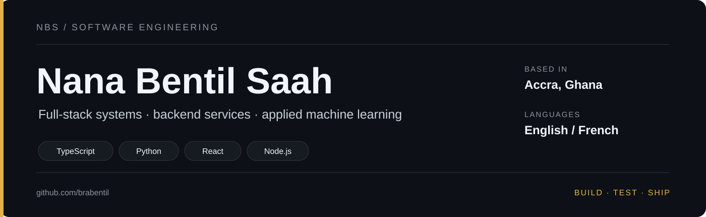
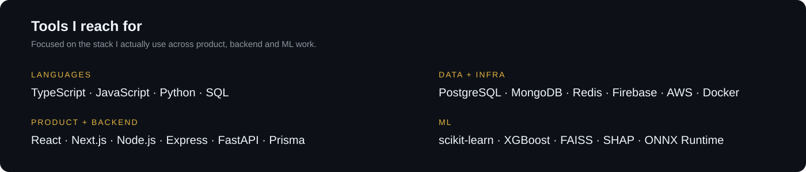

  

  <a href="https://brabentil.vercel.app"><b>Portfolio</b></a>
  &nbsp;&nbsp;·&nbsp;&nbsp;
  <a href="https://www.linkedin.com/in/nana-bentil-saah"><b>LinkedIn</b></a>
  &nbsp;&nbsp;·&nbsp;&nbsp;
  <a href="mailto:nbensaah@gmail.com"><b>Email</b></a>

I build software across **full-stack systems, backend services and applied machine learning**. I’m most interested in the parts that sit beneath the surface: data modelling, access control, retrieval, offline behaviour, model evaluation, performance, integrations and deployment.

  

## Selected work

<table>
<tr>
<td width="50%" valign="top">

### Career Services Platform

`Next.js` `TypeScript` `Prisma` `PostgreSQL` `NextAuth` `Playwright`

A multi-role platform for students, employers and alumni, covering identity, job postings, mentorships, messaging and administrative workflows.

**159 API routes** · **30% fewer requests** · **FCP 338ms → 125ms** · **35 unit/integration + 6 E2E tests**

Private codebase

</td>
<td width="50%" valign="top">

### BlackStar AI

`FastAPI` `FAISS` `scikit-learn` `sentence-transformers` `Next.js`

A retrieval-augmented QA system for the 2025 Ghana Budget and election results. It combines vector search with TF-IDF, token-budgeted context selection and citation-grounded responses.

**Hybrid retrieval** · **experiment logging** · **grounded citations**

[Live demo →](https://blackstart-ai.vercel.app)

</td>
</tr>
<tr>
<td width="50%" valign="top">

### KULA

`React Native` `Firestore` `SQLite` `SecureStore`

An offline-first community app built around optimistic updates, local persistence and background synchronization for unstable connectivity.

**Outbox queue** · **2s → 4s → 8s retry backoff** · **GPS / camera / microphone**

Private codebase

</td>
<td width="50%" valign="top">

### Whispr

`Flutter` `ONNX Runtime` `Wav2Vec2` `ECAPA-TDNN` `Silero VAD`

A privacy-first Android safety app with on-device wake-phrase and gesture detection, tied to cancelable SMS alerts and location tracking.

**On-device inference** · **voice activity detection** · **audio feature pipeline**

Private codebase

</td>
</tr>
</table>

<b>More things I've built</b>

 

- **ThriftHub Ghana** — e-commerce platform with CLIP-based image matching, Socket.IO notifications, Redis caching and Paystack payments. [Demo →](https://thrifthub-orcin.vercel.app)
- **AegisX** — fraud-detection prototype built for the Petra Hackathon; finished as a **Top 10 finalist**. [Demo →](https://aegis-x.vercel.app)
- **Academic City CV Book** — MERN platform for CV search, filtering and student-employer matching. [Demo →](https://acity-cv-book.vercel.app)
- **Freelance projects** — production websites for hospitality and community clients, with deployment, media handling, SEO and handover work.

## ML notebook

| Problem | What I explored | Best result / takeaway |
|---|---|---|
| **Credit-card default risk** | Logistic Regression, Decision Tree, SVM-RBF, Random Forest, XGBoost | XGBoost **ROC-AUC 0.7895**; L1 Logistic Regression best **F1 0.5419** |
| **NBA salary forecasting** | Longitudinal data, temporal splitting, XGBoost, SHAP, permutation importance | Best test **R² ≈ 0.737** |
| **Crop-yield prediction** | Linear, polynomial and L1-regularized regression; classification framing | Polynomial regression **R² ≈ 0.97**; classifier **92.7% accuracy** |
| **Customer segmentation** | K-Means, PCA, t-SNE, high-dimensional noise experiment | Studied silhouette degradation as noise features increased |

## Stack

  

## Experience

| | |
|---|---|
| **Nyansapo STEM** | **STEM Teacher & Curriculum Developer (Part-time)** — taught Python to **19 students** and contributed to programming/STEM curriculum development. |
| **Old Mutual Ghana** | **Software Developer Intern** — worked on Node/Express claim services with PostgreSQL, Redis and AWS; the work helped reduce claims turnaround from **5 days to under 2 days**. |
| **Dobiison / 360Africa** | **Full-Stack Developer Intern** — built a React + Node/Express platform cataloguing **50+ African historical sites**, with virtual tours, analytics and content management. |
| **Tullow Ghana** | **Digital Team Intern** — worked with IT/hardware support and gained exposure to operational technology in oil and gas. |
| **Kosmos Energy** | **Network Engineer Intern** — worked with routing, switching, firewalls, VLANs, OSPF/BGP and network automation concepts in Python. |
| **Independent** | **Freelance Web Developer** — production web projects for clients across hospitality and community platforms. |

## Background

**B.Sc. Computer Science — Academic City University**  
**Petra Hackathon — Top 10 Finalist**, AegisX

I’ve also co-led **Google Developer Groups on Campus** activities, introduced children to basic AI concepts through **Yamoransa Model Labs**, and spent four seasons coaching **Warriors FC** at Academic City.

---

  <b>Software · Web · Applied ML</b> 
  Accra, Ghana · English / French  
  <a href="https://www.linkedin.com/in/nana-bentil-saah">LinkedIn</a>
  &nbsp;·&nbsp;
  <a href="https://brabentil.vercel.app">Portfolio</a>
  &nbsp;·&nbsp;
  <a href="mailto:nbensaah@gmail.com">Email</a>

