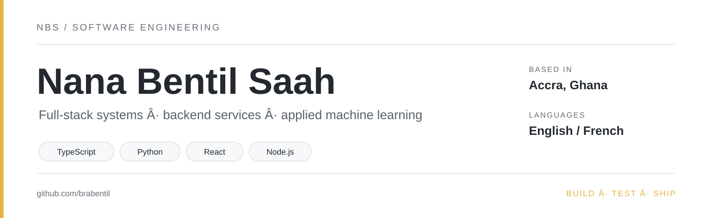
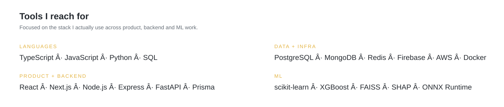
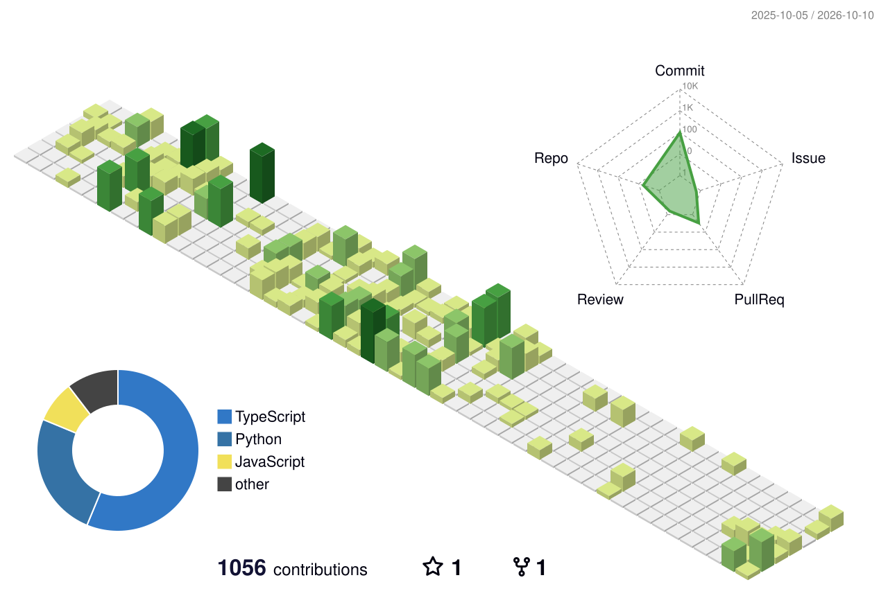

<picture>
  <source media="(prefers-color-scheme: dark)" srcset="./assets/hero-dark.svg">
  <source media="(prefers-color-scheme: light)" srcset="./assets/hero-light.svg">
  
</picture>

  <a href="https://brabentil.vercel.app">Portfolio</a>
  &nbsp;·&nbsp;
  <a href="https://www.linkedin.com/in/nana-bentil-saah">LinkedIn</a>
  &nbsp;·&nbsp;
  <a href="mailto:nbensaah@gmail.com">Email</a>

I build across **full-stack systems, backend services, and applied machine learning**. I like work where the interesting part sits below the UI: data modelling, access control, retrieval, offline behaviour, model evaluation, performance, integrations and deployment.

<picture>
  <source media="(prefers-color-scheme: dark)" srcset="./assets/impact-dark.svg">
  <source media="(prefers-color-scheme: light)" srcset="./assets/impact-light.svg">
  
</picture>

## Selected work

### 01 — Career Services Platform
One of my larger full-stack builds: a multi-role platform for students, employers and alumni covering jobs, mentorships, messaging and administrative workflows. The backend grew to **159 API routes**, so a lot of the work became about keeping permissions, data access and client behaviour predictable as the system expanded.

`Next.js` `TypeScript` `Prisma` `PostgreSQL` `NextAuth` `TanStack Query` `Playwright`

**Some numbers:** 30% fewer requests · navigation reduced by 96 ms · FCP 338 ms → 125 ms · 35 unit/integration tests + 6 critical E2E journeys  
`Private codebase`

---

### 02 — BlackStar AI
A retrieval-augmented question-answering system built around Ghanaian public documents. I combined **vector retrieval and TF-IDF**, added token-budgeted context selection, and designed the answer flow around grounded citations rather than treating retrieval as a black box.

`Python` `FastAPI` `FAISS` `sentence-transformers` `scikit-learn` `Next.js`

[Live demo](https://blackstart-ai.vercel.app) · `Private codebase`

---

### 03 — KULA
An offline-first mobile app for newcomers, built around the assumption that connectivity will sometimes fail. Messages and actions can be applied optimistically, queued locally and synchronised in the background with **2s → 4s → 8s exponential backoff**.

`React Native` `Firebase Auth` `Cloud Firestore` `SQLite` `SecureStore` `AsyncStorage`

`Private codebase`

---

### 04 — Whispr
A privacy-focused Android safety app that performs wake-phrase and gesture detection on-device. The audio pipeline combines **Wav2Vec2, ECAPA-TDNN, Silero VAD and ONNX Runtime**, then ties detection into cancelable SMS alerts and location tracking.

`Flutter` `Dart` `ONNX Runtime` `Firebase` `Hive`

`Private codebase`

## Applied ML

| Problem | What I explored | Result |
| --- | --- | --- |
| Credit-card default risk | Logistic regression, SVM-RBF, Random Forest, XGBoost, class weighting and feature importance | Best ROC-AUC **0.7895**; best F1 **0.5419** |
| NBA salary forecasting | Five-source longitudinal dataset, strict temporal splits, XGBoost, SHAP and permutation importance | Test **R² ≈ 0.737** |
| Crop-yield prediction | Linear, polynomial and L1 regression plus a classification framing | Polynomial **R² ≈ 0.97**; classification accuracy **92.7%** |
| Customer segmentation | K-Means, PCA, t-SNE and a distance-paradox noise experiment | Silhouette **0.3322** before synthetic noise degradation |

## Toolkit

<picture>
  <source media="(prefers-color-scheme: dark)" srcset="./assets/stack-dark.svg">
  <source media="(prefers-color-scheme: light)" srcset="./assets/stack-light.svg">
  
</picture>

## Experience

**2026 · Nyansapo STEM — STEM Teacher & Curriculum Developer**  
Taught Python to **19 students** and contributed to the programming/STEM curriculum.

**2025 · Old Mutual Ghana — Software Developer Intern**  
Built Node.js/Express services for seven claim types, worked with PostgreSQL, Redis and AWS, and helped reduce claims turnaround from roughly five days to under two.

**2025 · Dobiison / 360Africa — Full-Stack Developer Intern**  
Built a React and Node.js platform cataloguing 50+ African historical sites, including an admin dashboard, analytics and content-management workflows.

**2025 · Tullow Ghana — Digital Team Intern**  
Worked across IT support, hardware and network infrastructure while learning how technology fits into oil-and-gas operations.

**2024 · Kosmos Energy — Network Engineer Intern**  
Worked with routers, switches, firewalls, VLANs, OSPF/BGP and network automation concepts.

**2024–present · Independent — Web Developer**  
Built and delivered client websites with React/Next.js, containerised deployment, media pipelines, SEO and handover documentation.

## Beyond code

- **Google Developer Groups on Campus** — co-led technical workshops and helped organise ACity Hackathon 1.0.
- **Yamoransa Model Labs** — introduced children to foundational AI concepts using interactive pattern-recognition activities.
- **Warriors FC** — coached the university football team across four seasons.
- **Academic City University** — B.Sc. Computer Science.

## Activity

This section is generated from GitHub itself and updates automatically once the included workflow has run.

<picture>
  <source media="(prefers-color-scheme: dark)" srcset="./profile-3d-contrib/profile-night-green.svg">
  <source media="(prefers-color-scheme: light)" srcset="./profile-3d-contrib/profile-green-animate.svg">
  
</picture>

---

  <a href="https://brabentil.vercel.app">brabentil.vercel.app</a>
  &nbsp;·&nbsp;
  <a href="https://www.linkedin.com/in/nana-bentil-saah">LinkedIn</a>
  &nbsp;·&nbsp;
  <a href="mailto:nbensaah@gmail.com">Email</a>

