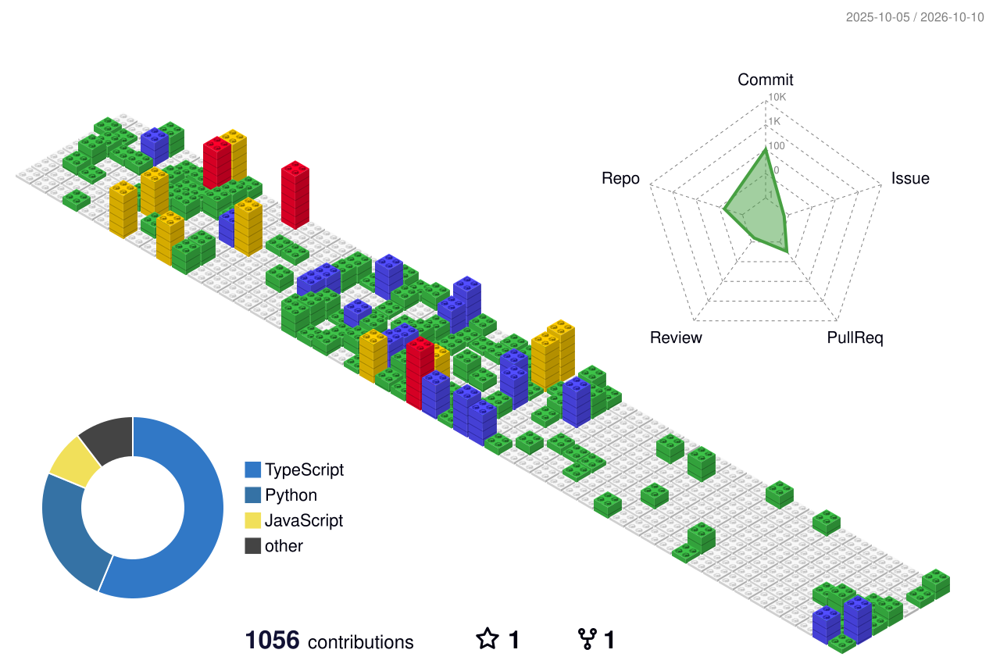

<picture>
  <source media="(prefers-color-scheme: dark)" srcset="./assets/hero-v5-dark.svg">
  <source media="(prefers-color-scheme: light)" srcset="./assets/hero-v5-light.svg">
  
</picture>

  <a href="https://brabentil.vercel.app">Portfolio</a>
  &nbsp;&nbsp;/&nbsp;&nbsp;
  <a href="https://www.linkedin.com/in/nana-bentil-saah">LinkedIn</a>
  &nbsp;&nbsp;/&nbsp;&nbsp;
  <a href="mailto:nbensaah@gmail.com">Email</a>

I build across **full-stack systems, backend services, and applied machine learning**. I am most interested in the parts that sit below the interface: data modelling, access control, retrieval, offline behaviour, model evaluation, performance, integrations, and deployment.

## Selected work

### Career Services Platform
A multi-role platform for students, employers, and alumni covering jobs, mentorships, messaging, and administrative workflows. As the system grew, much of the engineering work became about keeping permissions, data access, and client behaviour predictable.

`Next.js` `TypeScript` `Prisma` `PostgreSQL` `NextAuth` `TanStack Query` `Playwright`

**159 API routes** / **30% fewer requests** / **FCP 338ms to 125ms** / **35 unit and integration tests + 6 critical E2E journeys**

*Private repository*

---

### BlackStar AI
A retrieval-augmented question-answering system built around Ghanaian public documents. I combined vector retrieval with TF-IDF, added token-budgeted context selection, and designed the answer flow around grounded citations rather than treating retrieval as a black box.

`Python` `FastAPI` `FAISS` `sentence-transformers` `scikit-learn` `Next.js`

[Live demo](https://blackstart-ai.vercel.app) / *Private repository*

---

### KULA
An offline-first mobile app for newcomers, built around the assumption that connectivity will sometimes fail. Actions can be applied optimistically, queued locally, and synchronised in the background using exponential backoff.

`React Native` `Firebase Auth` `Cloud Firestore` `SQLite` `SecureStore` `AsyncStorage`

*Private repository*

---

### Whispr
A privacy-focused Android safety app that performs wake-phrase and gesture detection on-device. The audio pipeline combines Wav2Vec2, ECAPA-TDNN, Silero VAD, and ONNX Runtime, then connects detection to cancelable SMS alerts and location tracking.

`Flutter` `Dart` `ONNX Runtime` `Firebase` `Hive`

*Private repository*

## Applied ML

| Project | Approach | Result |
| --- | --- | --- |
| **Credit-card default risk** | Logistic regression, SVM-RBF, Random Forest, XGBoost, class weighting, feature importance | Best ROC-AUC **0.7895**; best F1 **0.5419** |
| **NBA salary forecasting** | Five-source longitudinal dataset, temporal splits, XGBoost, SHAP, permutation importance | Test **R2 about 0.737** |
| **Crop-yield prediction** | Linear, polynomial and L1 regression plus a classification framing | Polynomial **R2 about 0.97**; classification accuracy **92.7%** |
| **Customer segmentation** | K-Means, PCA, t-SNE, and a synthetic-noise distance experiment | Silhouette **0.3322** before noise degradation |

## Toolkit

**Languages**  
`TypeScript` `JavaScript` `Python` `SQL`

**Frontend**  
`React` `Next.js` `Tailwind CSS` `React Native` `Flutter`

**Backend**  
`Node.js` `Express` `FastAPI` `REST APIs` `Socket.IO`

**Data**  
`PostgreSQL` `Prisma` `MongoDB` `Redis` `Firebase` `SQLite`

**Machine Learning**  
`scikit-learn` `XGBoost` `FAISS` `pandas` `NumPy` `ONNX Runtime`

**Delivery**  
`AWS` `Docker` `GitHub Actions` `Vercel` `Cloudinary`

## Experience

| Year | Organisation | Role |
| --- | --- | --- |
| 2026 | **Nyansapo STEM** | STEM Teacher & Curriculum Developer |
| 2025 | **Old Mutual Ghana** | Software Developer Intern |
| 2025 | **Dobiison / 360Africa** | Full-Stack Developer Intern |
| 2025 | **Tullow Ghana** | Digital Team Intern |
| 2024 | **Kosmos Energy** | Network Engineer Intern |
| 2024-present | **Independent** | Web Developer |

At **Old Mutual Ghana**, I worked on backend services for seven claim types and helped reduce claims turnaround from roughly **five days to under two days**.

At **Nyansapo STEM**, I taught Python to **19 students** and contributed to the programming/STEM curriculum.

## Beyond code

**Google Developer Groups on Campus** - co-led technical workshops and helped organise ACity Hackathon 1.0.  
**Yamoransa Model Labs** - introduced children to foundational AI concepts using interactive pattern-recognition activities.  
**Warriors FC** - coached the university football team across four seasons.  
**Academic City University** - B.Sc. Computer Science.

## Contributions

<picture>
  <source media="(prefers-color-scheme: dark)" srcset="./profile-3d-contrib/profile-night-view.svg">
  <source media="(prefers-color-scheme: light)" srcset="./profile-3d-contrib/profile-gitblock.svg">
  
</picture>

---

  <a href="https://brabentil.vercel.app">Portfolio</a>
  &nbsp;&nbsp;/&nbsp;&nbsp;
  <a href="https://www.linkedin.com/in/nana-bentil-saah">LinkedIn</a>
  &nbsp;&nbsp;/&nbsp;&nbsp;
  <a href="mailto:nbensaah@gmail.com">Email</a>

